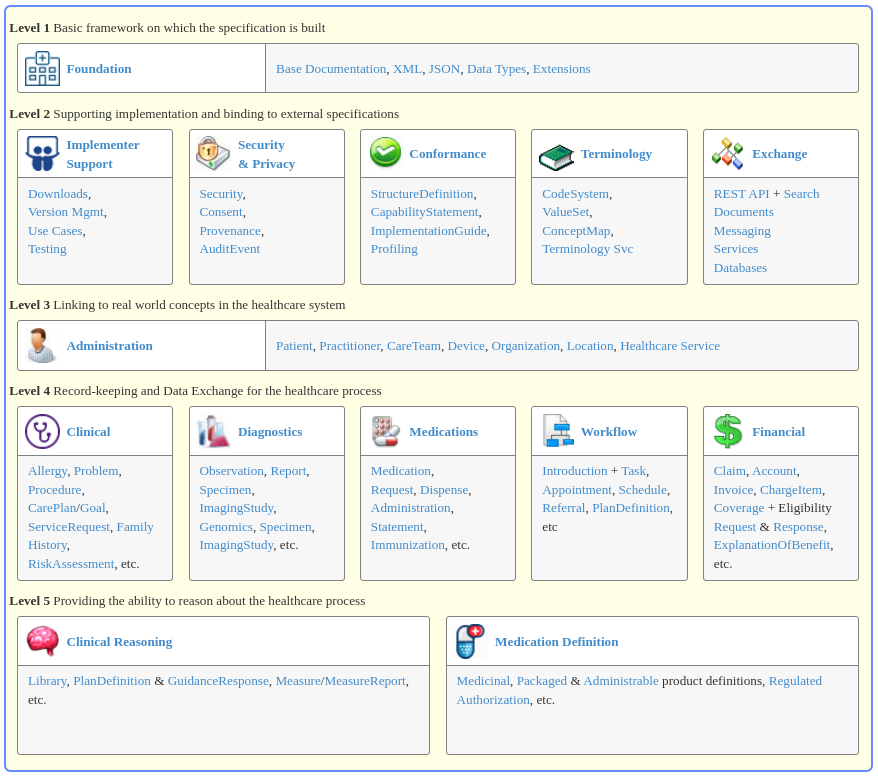
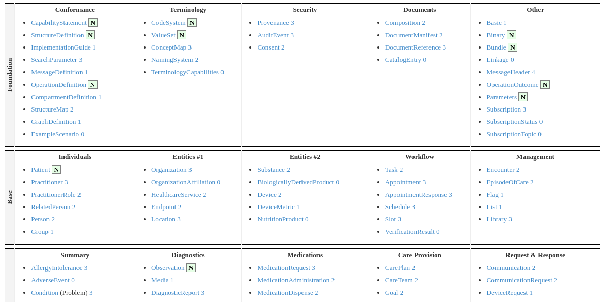
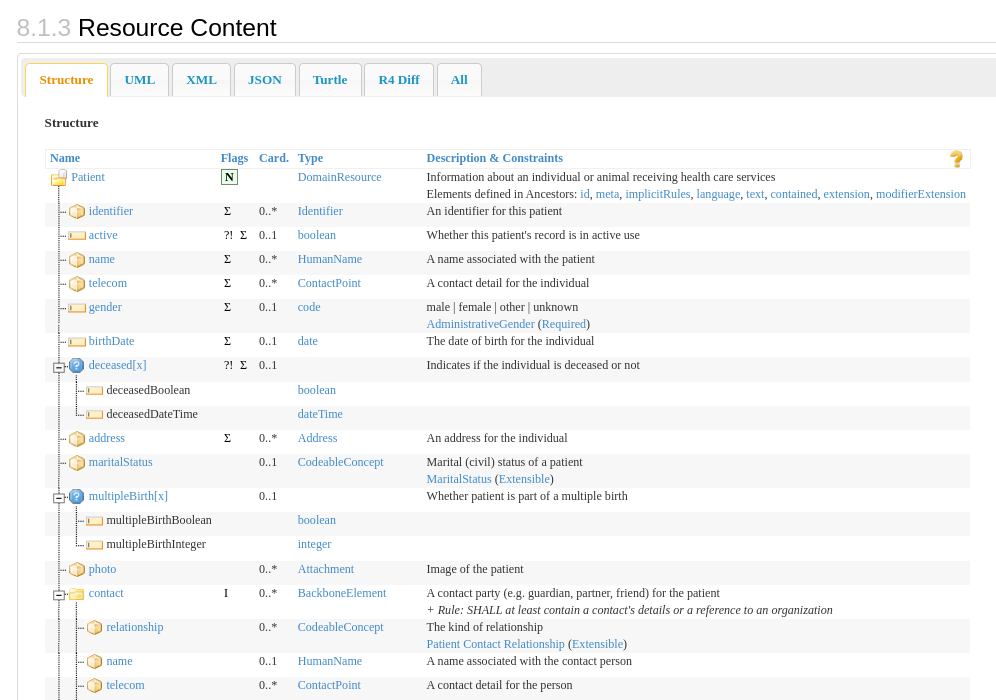

# Fast Heahtcare Interoperability Resources (FHIR)

## Introduction

+ FHIR (Fast Healthcare Interoperability Resources)is a standard for exchanging healthcare information electronically that was developed by Health Level Seven (HL7, http://www.hl7.org), an international standards organization for healthcare. It is designed to be flexible, easy to implement, and support interoperability between different healthcare systems.

+ FHIR was first published in 2014 as a draft standard for trial use and has since been updated and revised several times (Publication history: http://hl7.org/fhir/directory.html). FHIR was developed in response to the need for a modern, internet-based standard that could better support the exchange of healthcare information between systems.

+ FHIR is important because it enables better interoperability between different healthcare systems, which can improve patient care and outcomes. It also allows for better data management and can reduce costs associated with healthcare delivery.

## What is FHIR?

+ FHIR is based on a modern web-based architecture and uses resources to represent healthcare information.
    + Resources are modular and flexible, allowing them to be combined in various ways to represent different types of healthcare information.

+ FHIR also uses standard web technologies to enable data exchange between different systems. For example:
    + RESTful APIs,
    + JSON and RDF data formats

+ FHIR's principles include simplicity, flexibility, and extensibility.
    + It is designed to be easy to implement, with a low barrier to entry for developers.
    + FHIR also allows for custom extensions to be added to the standard, which enables it to be adapted to meet specific healthcare needs.

+ FHIR is not a replacement for other healthcare standards, such as HL7 v2. It is designed to complement and work alongside existing standards to enable better interoperability and data exchange.
    + Since many developers are already familiar with web technologies, their learning curve is less steep than earlier standards.
    + The RESTful API replaces point-to-point interfaces with one-to-many interfaces, making it considerably simpler to share data and increase interoperability between electronic health record (EHR) systems and several other devices and systems, such as mobile applications, mobile devices, and wearables.

## How FHIR Works

The FHIR standard covers several areas (http://hl7.org/fhir/)

There are three very important principles to FHIR:
+ Resources to represent healthcare information
+ RESTful API to exchange data
+ The 80/20 rule and a flexible mechanism based on profiles and extensions

### FHIR Resource Types

A main component of the FHIR standard are resources (http://hl7.org/fhir/resourcelist.html)
+ represent healthcare information
+ define a data model.

Resources have a differnt maturity level which specifies how stable the resource is.

All resources have a well documented structure with attributes and their corresponding data types.

Here for example the Patient resource (http://hl7.org/fhir/patient.html#resource):

### RESTful API

The other fundamental aspect is the RESTful API (http://hl7.org/fhir/http.html) used to exchange data.

+ FHIR is designed to be used with web-based technologies, such as HTTP and JSON, which allow for easy and efficient data exchange.
+ The RESTful API enables developers to interact with FHIR resources through a set of standard HTTP requests, such as GET, POST, PUT, and DELETE.
+ Additionally aspects of security and data privacy are included in the standard as well (http://hl7.org/fhir/secpriv-module.html).

## FHIR’s Benefits

Using FHIR has several benefits compared to other healthcare communication standards. The main benefits are:

+ Improved data accessibility and interoperability
    + Use of standard well known web technologies
    + Many more types of systems can easily be interconnected
+ Enhanced data management
    + Shared data model and a structured way to think about health
    + Structured data capture
    + AI and analytics
+ Better patient care
    + Structure data improves data quality enables enhanced quality and safety
    + Support within the standard for tasking and coordination of care
+ Cost reduction
    + Use of standard well known web technologies
    + Many more developers familiar with the basic technology
    + Standards promote specialization which creates software ecosystems

## FHIR Implementation

+ FHIR can be implemented in a variety of healthcare settings, including hospitals, clinics, and other healthcare organizations.
+ There are many different use cases for FHIR, including clinical decision support, patient portals, and remote patient monitoring.
+ However, there are also challenges and considerations that need to be taken into account when implementing FHIR, such as:
    + security and privacy concerns,
    + data quality,
    + and interoperability with other healthcare systems.

## Conclusion

+ FHIR is an important healthcare standard that provides a flexible and extensible way to exchange healthcare information electronically.
+ FHIR's use of modern web technologies like REST and HTTP makes it easier to implement and integrate with other healthcare systems.
+ FHIR provides a number of benefits over other healthcare standards, including improved interoperability, enhanced data management, and cost reduction.
+ While there are challenges and considerations that need to be taken into account when implementing FHIR, it has the potential to transform healthcare by improving patient care and outcomes.
